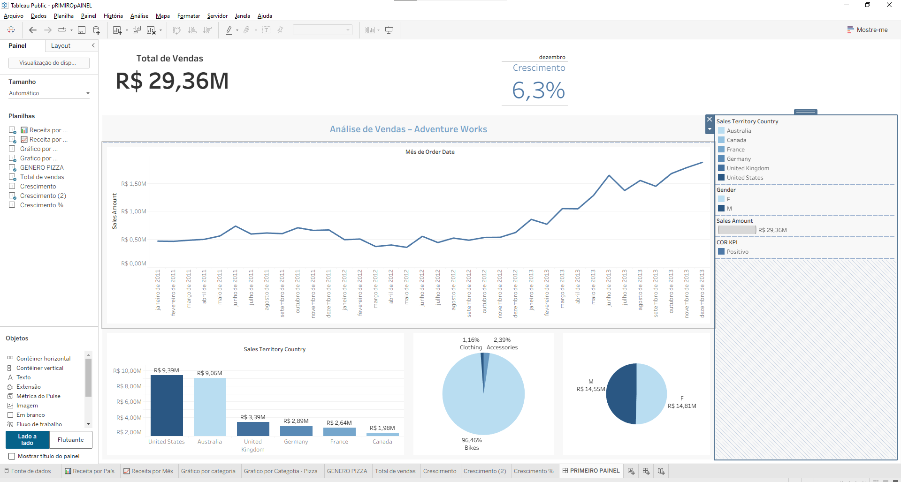
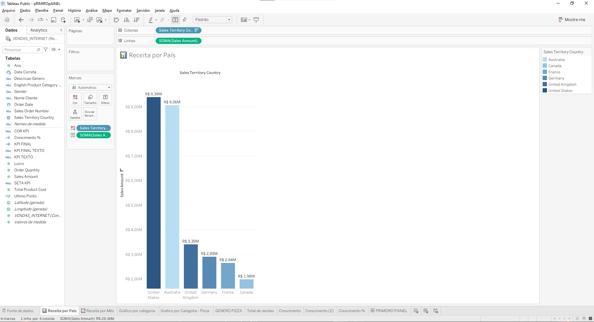
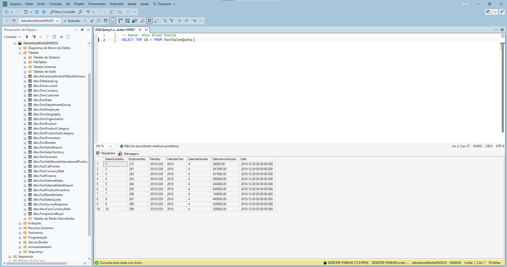
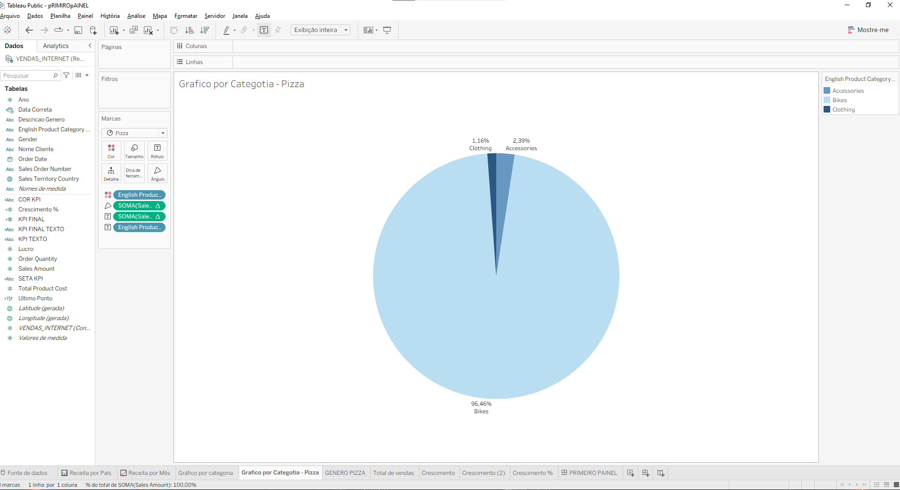
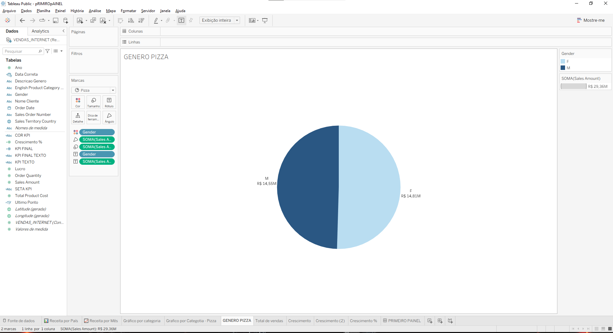
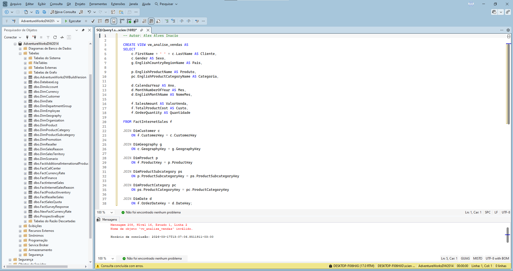
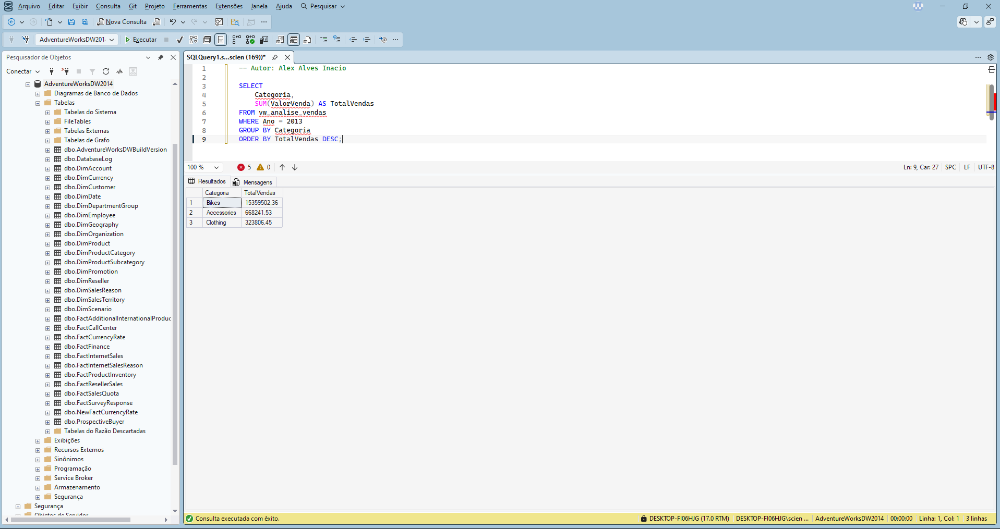
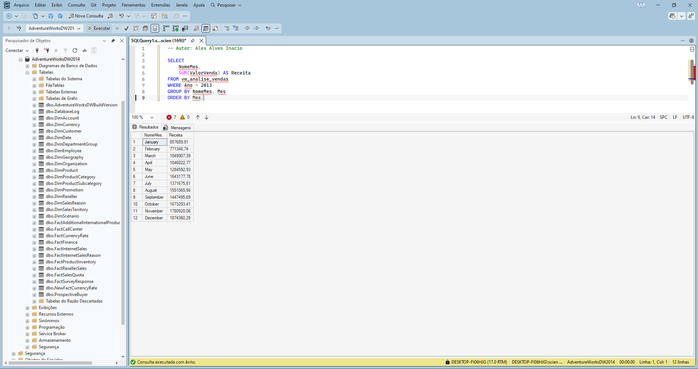
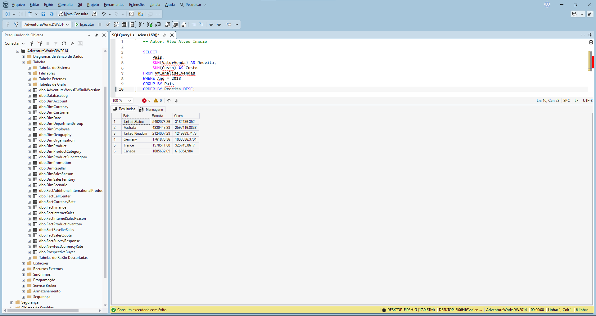
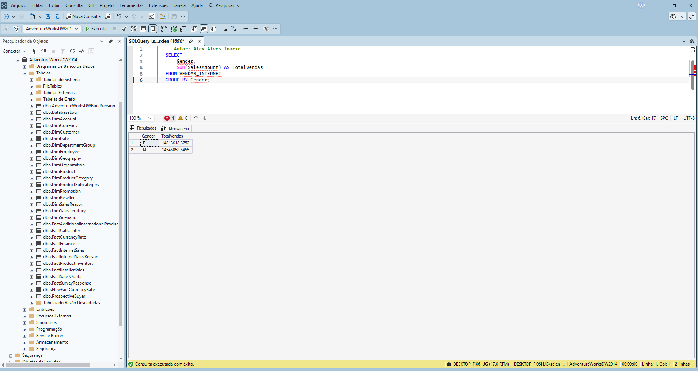

# 📊 Dashboard de Vendas com Tableau + SQL

## 🚀 Dashboard Final

---

## 📌 Sobre o Projeto

Este projeto apresenta uma análise completa de vendas utilizando **SQL** para extração e transformação dos dados e **Tableau** para construção de um dashboard interativo.

O objetivo é demonstrar, de forma prática, como transformar dados brutos em **insights estratégicos de negócio**.

---

## 🛠️ Tecnologias Utilizadas

* SQL (extração e análise dos dados)
* Tableau Public (visualização e dashboard)
* Excel (apoio e validação)

---

## 📊 Principais Análises

* 💰 Receita total de vendas
* 📈 Crescimento percentual mensal
* 📅 Evolução das vendas ao longo do tempo
* 🌎 Vendas por país
* 👥 Segmentação por gênero
* 🧩 Participação por categoria

---

## 📷 Etapas e Visualizações do Projeto

### 1️⃣ Receita por País

---

### 2️⃣ Consulta SQL - Sales

---

### 3️⃣ Receita Geral

---

### 4️⃣ Consulta SQL - Internet Sales

---

### 5️⃣ Vendas por Categoria

---

### 6️⃣ Criação de View SQL

---

### 7️⃣ Distribuição por Gênero

---

### 8️⃣ Validação dos Dados

---

### 9️⃣ Vendas por Categoria (Barras)

---

### 🔟 Evolução de Receita por Mês

---

### 1️⃣1️⃣ Receita vs Custo por País

---

### 1️⃣2️⃣ Vendas por Gênero

---

## 🧠 Principais Insights

* Receita total de aproximadamente **R$ 29,36M**
* Crescimento positivo no período mais recente (**6,3%**)
* Estados Unidos como principal mercado
* Categoria **Bikes** com maior participação
* Distribuição equilibrada entre gêneros

---

## 🔎 Processo do Projeto

1. Extração de dados com SQL
2. Criação de consultas e views
3. Validação dos dados
4. Modelagem para análise
5. Construção do dashboard no Tableau
6. Geração de insights

---

## 📈 Próximos Passos

* Implementar análise ano a ano (YoY)
* Criar previsões de vendas
* Melhorar interatividade do dashboard
* Publicar no Tableau Public

---

## 👨‍💻 Autor

**Alex Alves**
Analista de Automação | Dados, SQL, Tableau e IA
